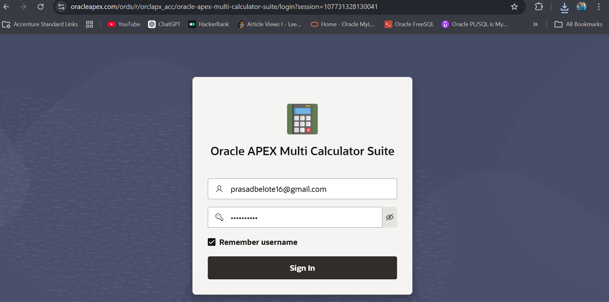
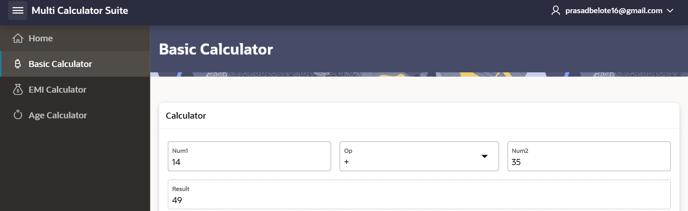
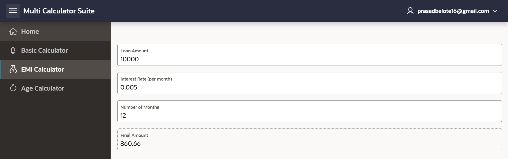
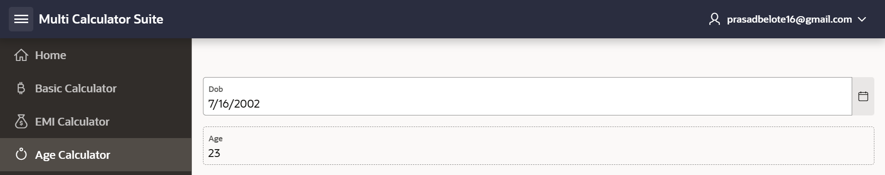

# Oracle APEX Multi Calculator Suite

This project demonstrates multiple calculators built using Oracle APEX with Dynamic Actions and PL/SQL.

## 🚀 Features

### 🧮 Basic Calculator
- Performs addition, subtraction, multiplication, and division
- Auto-calculates using Dynamic Actions (no button)

### 💰 EMI Calculator
- Calculates EMI based on loan amount, interest rate, and time
- Supports yearly interest rate input

### 🎂 Age Calculator (Planned)
- Calculates age from date of birth

---

## 🧠 Technologies Used
- Oracle APEX
- PL/SQL
- Dynamic Actions

---

## 📸 Screenshots

---

## 🚀 Author
Prasad Belote
